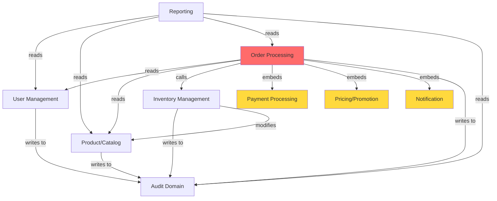

# Enterprise Monolith Domain Analysis

## Executive Summary
The `enterprise_monolith.py` file contains **6 distinct business domains** that are tightly coupled through direct function calls, shared global state, and embedded business logic. This analysis identifies each domain, their dependencies, and critical coupling points that should be addressed during refactoring.

---

## Identified Business Domains

### 1. **User Management Domain**

**Primary Functions:**
- `create_user()` (lines 73-128) - User registration with validation
- `login_user()` (lines 130-154) - Authentication and session management

**Variables & Data Structures:**
- `users_table` (line 31) - Global user repository
- `sessions_table` (line 34) - Active session storage
- `temp_list` (line 36) - Temporary user ID tracking

**Constants Used:**
- `SECRET_KEY` (line 28) - Password hashing
- `SESSION_TIMEOUT` (line 27) - Session expiration
- `DEFAULT_REGION` (line 22) - Default user region

**External Dependencies:**
- Audit Domain (writes to `audit_table`)
- Notification Domain (sends welcome emails)

---

### 2. **Product/Catalog Domain**

**Primary Functions:**
- `add_product()` (lines 156-185) - Product creation and catalog management

**Variables & Data Structures:**
- `products_table` (line 32) - Global product catalog
- Product attributes: pid, name, sku, price, category, quantity, warehouse, ratings, reviews

**Constants Used:**
- None specific to this domain

**External Dependencies:**
- Audit Domain (writes to `audit_table`)
- Inventory Domain (initializes quantity)

---

### 3. **Inventory Management Domain**

**Primary Functions:**
- `update_inventory()` (lines 187-202) - Stock level management (add/subtract/set operations)

**Variables & Data Structures:**
- `products_table` (line 32) - **SHARED** with Product Domain
- Manages: quantity levels, stock operations

**Constants Used:**
- None specific

**External Dependencies:**
- Audit Domain (logs inventory changes)
- Product Domain (reads/writes product quantities)

---

### 4. **Order Processing Domain**

**Primary Functions:**
- `process_everything()` (lines 204-364) - **MEGA FUNCTION** handling entire order workflow

**Variables & Data Structures:**
- `orders_table` (line 33) - Order records
- `temp_list` (line 36) - Order ID tracking
- Order attributes: oid, uid, items, pricing, payment info, shipping address

**Constants Used:**
- `TAX_RATE` (line 19) - Tax calculation
- `DISCOUNT_THRESHOLD` (line 20) - Automatic discount trigger
- `MAX_RETRIES` (line 21) - Payment retry logic
- `CURRENCY` (line 23) - Currency for transactions

**External Dependencies:**
- **User Management** (validates user, checks active status)
- **Product/Catalog** (validates products, checks availability)
- **Inventory Management** (calls `update_inventory()` directly - line 305)
- **Payment Processing** (embedded payment logic)
- **Pricing/Promotion** (embedded discount logic)
- **Notification** (sends order confirmation emails)
- **Audit Domain** (logs order events)

---

### 5. **Payment Processing Domain**

**Embedded in `process_everything()` (lines 262-303)**

**Logic Includes:**
- Card payment validation (lines 266-281)
- PayPal payment processing (lines 282-288)
- Wire transfer handling (lines 289-294)
- Retry mechanism (lines 264-301)

**Variables & Data Structures:**
- `pay_result` - Payment transaction result
- Payment methods: card, paypal, wire

**Constants Used:**
- `PAYMENT_GATEWAY_URL` (line 17)
- `PAYMENT_API_KEY` (line 18)
- `MAX_RETRIES` (line 21)
- `CURRENCY` (line 23)

**External Dependencies:**
- None (embedded within Order Processing)

---

### 6. **Pricing & Promotion Domain**

**Embedded in `process_everything()` (lines 239-256)**

**Logic Includes:**
- Promo code validation (SAVE10, SAVE20, FREESHIP)
- Automatic bulk discount (>$500)
- Tax calculation
- Total computation

**Variables & Data Structures:**
- `disc` - Discount amount
- `subtotal`, `tax`, `grand` - Pricing calculations

**Constants Used:**
- `TAX_RATE` (line 19)
- `DISCOUNT_THRESHOLD` (line 20)

**External Dependencies:**
- None (embedded within Order Processing)

---

### 7. **Notification/Email Domain**

**Embedded throughout multiple functions**

**Logic Includes:**
- Welcome email (line 105 in `create_user()`)
- Order confirmation email (lines 333-357 in `process_everything()`)
- Admin notification (lines 358-359 in `process_everything()`)

**Constants Used:**
- `SMTP_HOST`, `SMTP_PORT`, `SMTP_USER`, `SMTP_PASS` (lines 13-16)
- `ADMIN_EMAIL` (line 24)

**External Dependencies:**
- User Management (user email addresses)
- Order Processing (order details)

---

### 8. **Audit/Logging Domain**

**Embedded throughout multiple functions**

**Variables & Data Structures:**
- `audit_table` (line 35) - Global audit log
- Audit events: CREATE_USER, ADD_PROD, INV_UPDATE, ORDER

**Functions Writing to Audit:**
- `create_user()` (line 106)
- `add_product()` (line 179)
- `update_inventory()` (line 200)
- `process_everything()` (line 328)

**External Dependencies:**
- All domains (receives audit events)

---

### 9. **Reporting/Analytics Domain**

**Primary Functions:**
- `get_report()` (lines 366-416) - Generates various business reports

**Report Types:**
- Sales report (revenue, order count, by payment method, by category)
- Inventory report (total value, low stock, out of stock)
- User report (active/inactive counts, by region)
- Audit report (event counts, operation totals)

**Variables & Data Structures:**
- Reads from: `orders_table`, `users_table`, `products_table`, `audit_table`

**External Dependencies:**
- All domains (reads their data)

---

## Critical Tight-Coupling Points

### 🔴 **SEVERE COUPLING: Order Processing → Multiple Domains**

**Location:** `process_everything()` function (lines 204-364)

**Direct Coupling Issues:**

1. **User Management Coupling** (lines 207-215)
   ```python
   # Direct iteration over users_table
   for uu in users_table:
       if uu["uid"] == uid:
           u = uu
   ```
   - **Issue:** Direct access to global `users_table`
   - **Impact:** Cannot change user storage without modifying order processing

2. **Product/Catalog Coupling** (lines 223-238)
   ```python
   # Direct iteration over products_table
   for pp in products_table:
       if pp["pid"] == pid:
           found_p = pp
   ```
   - **Issue:** Direct access to global `products_table`
   - **Impact:** Product domain changes break order processing

3. **Inventory Management Coupling** (line 305)
   ```python
   self.update_inventory(vi["pid"], vi["qty"], "sub")
   ```
   - **Issue:** Direct method call to inventory function
   - **Impact:** Tight coupling between order and inventory domains
   - **Problem:** Inventory updates embedded in order flow

4. **Payment Processing Coupling** (lines 262-303)
   - **Issue:** Payment logic embedded directly in order processing
   - **Impact:** Cannot change payment providers without modifying order code
   - **Problem:** 60+ lines of payment code mixed with order logic

5. **Pricing/Promotion Coupling** (lines 239-256)
   - **Issue:** Discount and tax calculations embedded in order flow
   - **Impact:** Cannot modify pricing rules independently
   - **Problem:** Business rules hardcoded in order processing

6. **Notification Coupling** (lines 333-359)
   - **Issue:** Email formatting and sending embedded in order processing
   - **Impact:** Cannot change notification strategy without touching orders
   - **Problem:** 25+ lines of email template code in order function

---

### 🟡 **MODERATE COUPLING: Shared Global State**

**Global Variables Acting as Coupling Points:**

1. **`products_table`** - Shared between:
   - Product Domain (`add_product()`)
   - Inventory Domain (`update_inventory()`)
   - Order Processing (`process_everything()`)
   - Reporting (`get_report()`)

2. **`users_table`** - Shared between:
   - User Management (`create_user()`, `login_user()`)
   - Order Processing (`process_everything()`)
   - Reporting (`get_report()`)

3. **`audit_table`** - Written by:
   - User Management
   - Product Domain
   - Inventory Domain
   - Order Processing
   - Read by Reporting

4. **`temp_list`** - Used by:
   - User Management
   - Order Processing
   - **Issue:** Unclear purpose, potential data leak

---

### 🟡 **MODERATE COUPLING: Inventory → Product Domain**

**Location:** `update_inventory()` function (lines 187-202)

```python
for p in products_table:
    if p["pid"] == a:
        # Direct modification of product quantity
        p["qty"] = p["qty"] + b
```

- **Issue:** Inventory domain directly modifies product data structure
- **Impact:** Changes to product schema affect inventory operations
- **Problem:** No clear ownership of quantity field

---

### 🟢 **MINOR COUPLING: Audit Domain**

**Pattern:** Multiple domains write to `audit_table`

- **Issue:** All domains depend on audit table structure
- **Impact:** Changing audit format requires updates across all domains
- **Mitigation:** Relatively low risk due to simple append-only pattern

---

## Domain Dependency Graph



**Legend:**
- 🔴 Red: Severe coupling (Order Processing)
- 🟡 Yellow: Embedded domains (Payment, Pricing, Notification)
- 🔵 Blue: Other domains

---

## Coupling Severity Matrix

| Domain A | Domain B | Coupling Type | Severity | Line References |
|----------|----------|---------------|----------|-----------------|
| Order Processing | User Management | Direct data access | 🔴 HIGH | 207-215 |
| Order Processing | Product/Catalog | Direct data access | 🔴 HIGH | 223-238 |
| Order Processing | Inventory | Direct method call | 🔴 HIGH | 305 |
| Order Processing | Payment | Embedded logic | 🔴 HIGH | 262-303 |
| Order Processing | Pricing | Embedded logic | 🔴 HIGH | 239-256 |
| Order Processing | Notification | Embedded logic | 🔴 HIGH | 333-359 |
| Inventory | Product | Direct data modification | 🟡 MEDIUM | 189-199 |
| All Domains | Audit | Shared global state | 🟡 MEDIUM | Various |
| Reporting | All Domains | Read-only access | 🟢 LOW | 366-416 |

---

## Key Findings

### 1. **God Function Anti-Pattern**
The `process_everything()` function (160 lines) is a "god function" that:
- Handles 6+ different responsibilities
- Directly couples to 6+ domains
- Contains embedded business logic for payment, pricing, and notifications
- Violates Single Responsibility Principle

### 2. **Global State Pollution**
- 8 global variables create hidden dependencies
- No encapsulation or access control
- Difficult to test in isolation
- Risk of data corruption

### 3. **No Domain Boundaries**
- No clear separation between domains
- Business logic scattered across functions
- Difficult to understand domain responsibilities
- High risk when making changes

### 4. **Embedded Business Logic**
- Payment processing logic embedded in order flow
- Pricing rules hardcoded in order processing
- Email templates mixed with business logic
- Cannot change independently

---

## Refactoring Recommendations

### Priority 1: Extract Payment Domain
- Create separate `PaymentService` class
- Move payment logic (lines 262-303) to dedicated module
- Define clear payment interface
- **Impact:** Reduces order processing complexity by 40 lines

### Priority 2: Extract Pricing/Promotion Domain
- Create `PricingService` class
- Move discount/tax logic (lines 239-256) to separate module
- Define pricing rules as configuration
- **Impact:** Enables independent pricing changes

### Priority 3: Extract Notification Domain
- Create `NotificationService` class
- Move email logic (lines 333-359) to separate module
- Use template engine for emails
- **Impact:** Separates communication concerns

### Priority 4: Introduce Repository Pattern
- Create `UserRepository`, `ProductRepository`, `OrderRepository`
- Replace direct global variable access
- Encapsulate data access logic
- **Impact:** Enables database abstraction

### Priority 5: Break Down Order Processing
- Split `process_everything()` into smaller functions:
  - `validateOrder()`
  - `calculatePricing()`
  - `processPayment()`
  - `updateInventory()`
  - `createOrder()`
  - `sendNotifications()`
- **Impact:** Improves testability and maintainability

---

## Conclusion

The `enterprise_monolith.py` file exhibits classic monolithic anti-patterns with severe tight coupling between domains. The `process_everything()` function is the primary coupling point, directly accessing and manipulating data from 6+ different business domains. Refactoring should focus on:

1. Extracting embedded domains (Payment, Pricing, Notification)
2. Introducing clear domain boundaries
3. Replacing global state with proper encapsulation
4. Breaking down the god function into smaller, focused functions

**Estimated Refactoring Effort:** Medium-High (2-3 weeks for complete domain separation)
**Risk Level:** High (extensive changes required, high test coverage needed)